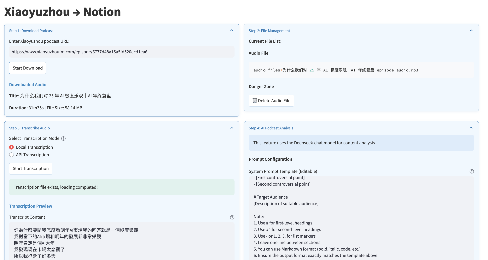

# Podcast Download, Transcribe, Analyze, and Storage

A streamlined solution for managing Xiaoyuzhou podcasts through automated processing and AI-powered insights. Direct integration with Notion enables organized knowledge management.

## Core Capabilities

- **Episode Retrieval**  
  Download audio with metadata preservation (title, host, date)

- **Adaptive Transcription**  
  Local processing via Faster-Whisper  
  Cloud-based Whisper API option  

- **Agent Summary**  
  Customizable query templates  
  Based on show notes

- **Notion Sync**  
  Automated database population  
  Rich-text formatting support  
  Metadata synchronization

- **Workflow Automation**  
  CLI processing via `auto_process.py`  
  Environment-driven configuration  

## Interface Preview

  
*Main processing interface*

## Quick Start

```bash
git clone https://github.com/KeriYuu/PodcastAnalyzer
cd PodcastAnalyzer
pip install -r requirements.txt
```

### Web Interface
```bash
streamlit run src/app.py
```
1. Input podcast URL  
2. Select processing options  
3. Review outputs → Push to Notion

### Automated Processing
Configure `.env`:
```env
PODCAST_URL=https://www.xiaoyuzhoufm.com/episode/your-episode-id
NOTION_TOKEN=your_integration_key
NOTION_DB_ID=your_database_id
OPENROUTER_API_KEY=your_ai_key
```

Execute:
```bash
python src/auto_process.py
```

## Technical Architecture

```
src/
├── app.py          # Web interface
├── auto_process.py # Batch processor
├── download.py     # Audio retrieval
├── transcribe.py   # Speech-to-text
├── analyze.py      # AI processing
└── notion_utils.py # Database sync
```

## Technical Architecture
